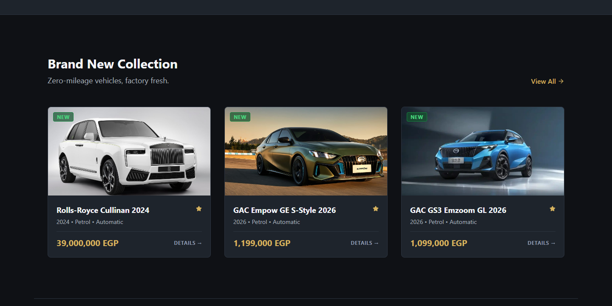
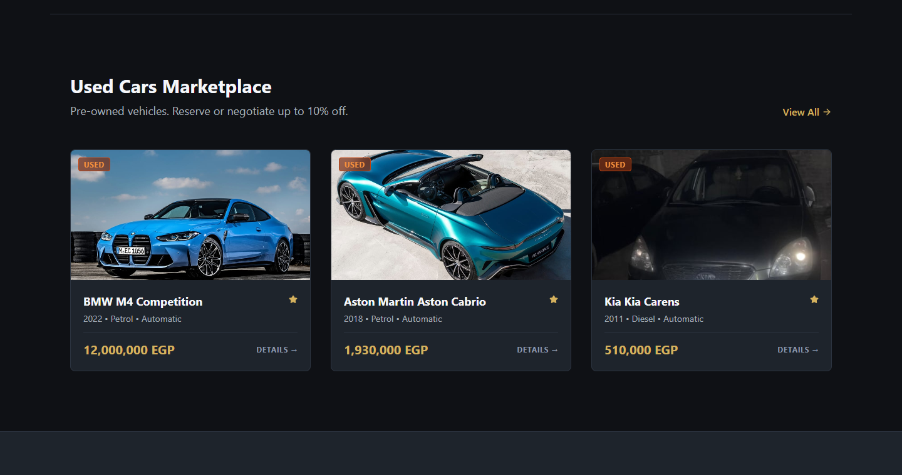

# Prestige Motors Showroom

Prestige Motors is a full-stack MERN showroom platform for browsing premium vehicle inventory, reserving new cars, negotiating used-car offers, submitting customer listings, and managing the complete admin approval workflow.

This repository is structured as a portfolio-ready full-stack project with a React/Vite frontend, an Express/MongoDB API, Cloudinary image uploads, JWT authentication, role-based admin access, and Vercel deployment configuration.

## Live Project

- Live demo: https://prestige-motor.vercel.app/
- Repository: https://github.com/Yehia-Alsaeed/prestige-motors-showroom

## Screenshots






## Tech Stack

| Layer | Technologies |
| --- | --- |
| Frontend | React 19, TypeScript, Vite, React Router, Tailwind CSS, Lucide React, React Hot Toast |
| Backend | Node.js, Express 5, MongoDB, Mongoose, JWT, bcrypt |
| Media | Cloudinary, Multer, Multer Storage Cloudinary |
| Security | Helmet, CORS, API rate limiting, password hashing, protected routes |
| Deployment | Vercel static build plus serverless Node API routes |

## Core Features

### Customer Experience

- Browse brand-new and pre-owned cars in separate catalog views.
- Search, filter, and sort inventory by brand, body type, fuel type, transmission, year, mileage, and price.
- View detailed vehicle pages with image galleries, specifications, pricing, and availability status.
- Register, log in, and manage customer profile details.
- Reserve new vehicles at fixed showroom prices.
- Submit offers on used vehicles within a controlled negotiation range.
- Track reservations, offers, personal listings, and incoming buyer offers from a customer dashboard.
- Submit a used-car listing with vehicle details, uploaded photos, and seller commission agreement.

### Admin Experience

- Protected admin login and admin-only dashboard routes.
- Dashboard metrics for inventory, customers, reservations, pending offers, and sales pipeline value.
- Manage available inventory and mark vehicles as sold.
- Upload, replace, reorder, and save vehicle image galleries.
- Review customer-submitted used-car listings.
- Approve listings for publication or reject them with customer-facing feedback.
- Review offers and reservations across showroom-owned and customer-listed vehicles.
- Reserve vehicles, reject offers, confirm completed sales, or return vehicles to display.

### Backend Capabilities

- REST API organized by authentication, cars, offers, reservations, customers, and uploads.
- MongoDB models for users, cars, offers, and reservations.
- JWT authentication with customer and admin authorization guards.
- Password hashing through bcrypt.
- Cloudinary image upload pipeline with file size limits and image transformation.
- Rate limiting for API, login, reservation, and offer endpoints.
- Configurable CORS, HTTPS support, and deployment-friendly environment variables.

## Repository Structure

```text
prestige-motors-showroom/
  backend/        Express API, MongoDB models, controllers, routes, auth, uploads
  frontend/       React Vite TypeScript interface for customers and admins
  vercel.json     Vercel build and rewrite configuration
  .gitignore      Local dependencies, builds, env files, and private reports
```

## Getting Started

### Prerequisites

- Node.js 20 or newer
- MongoDB database, local or hosted
- Cloudinary account for image uploads

### 1. Clone the Repository

```bash
git clone https://github.com/Yehia-Alsaeed/prestige-motors-showroom.git
cd prestige-motors-showroom
```

### 2. Install Dependencies

```bash
cd backend
npm install

cd ../frontend
npm install
```

### 3. Configure Environment Variables

Copy the example environment files, then replace the placeholder values with your local credentials:

```bash
cp backend/.env.example backend/.env
cp frontend/.env.example frontend/.env
```

Backend variables in `backend/.env.example`:

```env
PORT=5000
HOST=127.0.0.1
NODE_ENV=development
MONGO_URI=mongodb://localhost:27017/carshowroom
JWT_SECRET=replace-with-a-strong-secret
FRONTEND_URL=http://localhost:5173
CLOUDINARY_CLOUD_NAME=your-cloudinary-cloud-name
CLOUDINARY_API_KEY=your-cloudinary-api-key
CLOUDINARY_API_SECRET=your-cloudinary-api-secret
USE_HTTPS=false
```

Frontend variables in `frontend/.env.example`:

```env
VITE_API_URL=http://localhost:5000
```

For same-domain production deployments, `VITE_API_URL` can be set to an empty string so the frontend uses relative `/api` paths.

### 4. Run the Backend

```bash
cd backend
node server.js
```

The API will run at `http://localhost:5000` by default.

### 5. Run the Frontend

```bash
cd frontend
npm run dev
```

The frontend will run at `http://localhost:5173` by default.

## Available Frontend Scripts

```bash
npm run dev      # Start the Vite development server
npm run build    # Type-check and build the production frontend
npm run lint     # Run ESLint
npm run preview  # Preview the production build locally
```

## API Overview

| Route Group | Purpose |
| --- | --- |
| `/api/auth` | Customer registration, customer login, admin login, profile management |
| `/api/cars` | Public inventory, car details, admin inventory management, customer listing approvals |
| `/api/offers` | Used-car offers, seller responses, admin reservation decisions, sale confirmation |
| `/api/reservations` | Reservation creation and admin reservation status updates |
| `/api/customers` | Admin customer status management endpoints |
| `/api/upload` | Authenticated Cloudinary image uploads |

## Deployment

The project includes `vercel.json` for deploying the frontend and backend together on Vercel:

- `frontend/package.json` is built as a static Vite app.
- `backend/server.js` is deployed as a Node serverless function.
- `/api/*` requests are rewritten to the backend.
- All other routes are served through the frontend app.

Set the backend environment variables in the Vercel project settings before deploying.

## Security Notes

- `.env` files are ignored and should never be committed.
- `.env.example` files are committed intentionally with placeholder values only.
- JWT secrets, database URLs, and Cloudinary credentials must be configured through local or deployment environment variables.
- Auth, offer, reservation, and API routes include rate limiting.
- Admin-only routes are protected with JWT authentication and role checks.
- Demo credentials and seed data should be used only for local development.

## Project Status

Prestige Motors is a complete portfolio project demonstrating full-stack application development, role-based workflows, API design, database modeling, image uploads, authentication, deployment configuration, and a polished customer/admin interface.
